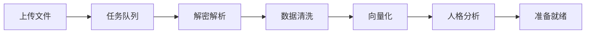

# Second Self Web App 架构设计

## 技术栈

### 前端
- **Next.js 14** - 全栈框架，支持SSR
- **TypeScript** - 类型安全
- **Tailwind CSS** - 快速样式开发
- **Shadcn/ui** - 现代UI组件库
- **Socket.io** - 实时通信

### 后端
- **FastAPI** (Python) - 主API服务
- **Celery** - 异步任务队列（处理数据导入）
- **Redis** - 缓存 + 任务队列
- **PostgreSQL** - 用户数据
- **Qdrant** - 向量数据库

### 部署
- **Docker** - 容器化
- **Vercel/Railway** - 前端部署
- **AWS/阿里云** - 后端部署

## 核心功能模块

### 1. 用户系统
```typescript
interface User {
  id: string;
  email: string;
  personas: Persona[];
  subscription: SubscriptionTier;
}

interface Persona {
  id: string;
  name: string;
  avatar?: string;
  sourceData: DataSource[];
  status: 'processing' | 'ready' | 'error';
  statistics: PersonaStats;
}
```

### 2. 数据导入流程


### 3. 对话界面
```typescript
// 对话组件
const ChatInterface = () => {
  return (
    <div className="flex flex-col h-screen">
      {/* 顶部：人格选择器 */}
      <PersonaSelector />
      
      {/* 中间：对话历史 */}
      <MessageList />
      
      {/* 底部：输入框 */}
      <MessageInput />
      
      {/* 侧边栏：人格信息 */}
      <PersonaSidebar />
    </div>
  );
};
```

### 4. API设计
```python
# FastAPI路由
@app.post("/api/personas/create")
async def create_persona(file: UploadFile, user_id: str):
    # 1. 保存文件
    file_path = await save_upload(file)
    
    # 2. 创建异步任务
    task = process_chat_data.delay(file_path, user_id)
    
    # 3. 返回任务ID供前端轮询
    return {"task_id": task.id, "status": "processing"}

@app.post("/api/chat/message")
async def send_message(
    persona_id: str,
    message: str,
    context: List[str] = []
):
    # 1. 检索相关消息
    retrieved = await hybrid_rag.retrieve(message, context)
    
    # 2. 生成回复
    response = await generate_response(message, retrieved)
    
    # 3. 流式返回
    return StreamingResponse(
        stream_response(response),
        media_type="text/event-stream"
    )
```

## MVP功能优先级

### P0 - 核心功能（第1个月）
- [ ] 用户注册/登录
- [ ] 微信聊天记录上传
- [ ] 数据解析和处理
- [ ] 基础对话功能
- [ ] 简单的Web界面

### P1 - 体验优化（第2个月）
- [ ] 实时对话（WebSocket）
- [ ] 人格统计展示
- [ ] 多人格管理
- [ ] 对话历史保存

### P2 - 增值功能（第3个月）
- [ ] 语音消息支持
- [ ] 图片/表情支持
- [ ] 导出对话记录
- [ ] API接口开放

## 数据流设计

```python
# 1. 数据导入
WeChat Backup → Decrypt → Parse → Clean → Store

# 2. 人格构建
Messages → Extract Features → Build Index → Create Profile

# 3. 对话生成
User Input → Retrieve Context → Generate Response → Stream Output
```

## 安全考虑

1. **数据加密**
   - 用户上传文件AES加密存储
   - 数据库字段级加密

2. **隐私保护**
   - 数据处理后删除原始文件
   - 用户可随时删除所有数据

3. **访问控制**
   - JWT认证
   - 人格数据严格隔离

## 商业模式

### 免费版
- 1个人格
- 每日100条对话
- 基础功能

### Pro版 (¥49/月)
- 5个人格
- 无限对话
- API访问
- 优先处理

### 企业版
- 无限人格
- 私有部署
- 定制功能

## 开发计划

### Week 1-2: 基础框架
- 搭建前后端框架
- 实现用户系统
- 文件上传功能

### Week 3-4: 核心功能
- 微信数据解析
- RAG系统实现
- 基础对话功能

### Week 5-6: 界面优化
- 完善UI/UX
- 实时通信
- 错误处理

### Week 7-8: 测试上线
- 功能测试
- 性能优化
- 部署上线